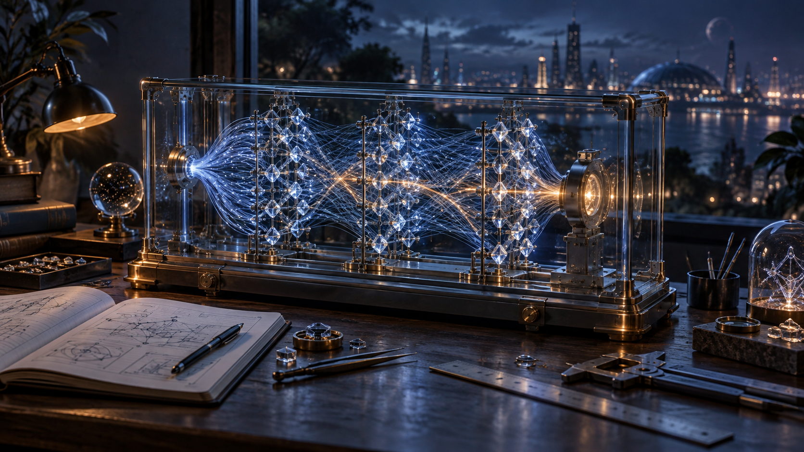

# Encased research instrument

This is a fresh implementation on the current native renderer, using the
PhotoCraft Portfolio hero as concept art. It does not import the older POC's
startup, inference, camera, or lifecycle code.

The unchanged reference PNG has SHA-256
`863e890efa5cf977d0b010d10006a51fd048d2e693fe0ff0fe0ae28d36a0c297`.
It is a design reference, not a downloaded background or a model observation.

## Rendering responsibilities

| Module | Responsibility |
|---|---|
| `model-encased-materials.js` | Steel, restrained brass fittings, clear glazing, faceted crystals, and an HDR studio reflection environment |
| `model-encased-housing.js` | Machined rails, rounded base plates, feet, screws, optical mounts, and five glazing surfaces |
| `model-encased-routes.js` | Curved source routes, aggregated endpoint magnitudes, and luminous physical fiber cores and halos |
| `model-scene.js` | Shared native camera, scene ownership, inference presentation, selection, disposal, and complete geometry fitting |

Homepage and articles instantiate the same geometry and materials. They retain
WebGPU with native DPR and 4x MSAA, with the existing WebGL2 path when needed.
The reflection environment is generated locally from three studio light panels;
it requires no HDR download, extra renderer, or per-frame environment rebuild.
The scene owns and disposes its reflection target.

The thin outer glazing uses restrained coverage alongside physical transmission.
This preserves transparent interior objects across both render backends; stacking
fully opaque transmission surfaces can erase the interior from their sampled
color buffer. Lightweight mode disables physical transmission while retaining
the housing, native controls, and crystal geometry.

The camera fitting geometry includes the full housing, base and feet, every
curved route, crystal coordinates, contours, and carrier envelopes. Picking,
highlighting, and probes use the same curved source paths. There is no separate
coordinate system for the artwork.

## Scientific identity

The existing eight stages, 1,668 nodes and 3,601 route bundles are retained, as are
the trained weights, worker inference, captured tensors and raw-coordinate
inspection. The artwork does not reduce the network to the three illustrative
crystal columns in the painting.

Blue is the resting presentation. Measured positive coordinates transition toward
warm gold; negative coordinates transition toward rose. Brightness remains
normalized per layer. A route uses the mean normalized absolute activation of
each of its declared endpoint groups, with the smaller endpoint magnitude setting
its strength. Route brightness is not an individual weight measurement.

All source routes use smooth curves. A fixed subset of those same routes also has
physical fiber geometry and soft luminous shells; these add depth without adding
connections or fabricated telemetry. Brass, reflections and housing supports are
decorative display hardware. The gold selection/probe treatment remains separate
from the coordinate inspector's recorded values.

The homepage uses a 132-second observation loop (twice the initial encased pace), eased signed-color and
brightness transitions, and continuous loop seam. Article generation, Hide,
Unpin, Follow, input, coordinate inspection, and native keyboard controls retain
their existing behavior. Quiet mode, pause, visibility suspension and retry remain
owned by the existing controllers.

## Review and publication

The new local assembled preview is served on port 4188. Its article prose comes
from the public publication; it is not an immutable production candidate.
The earlier preview on port 4187 and the original POC remain available separately.
The reference artwork is not a site runtime asset.

Native poster and compatibility recording producers render the same shared scene.
New scene modules are included in capture provenance, published asset identity,
and source syntax lists. The existing visual palette expectation is updated to
gold. No new tests or weakened source/identity gates are introduced.

Two inherited qualification issues are repaired in this branch: the homepage
diagnostic snapshot is split into bounded functions, and the existing Pages audit
explicitly selects the same isolated software WebGL environment used by the
recording producer. Neither change enables browser flags in the published site.

Review local images and controls before promoting this branch. Full exact-source
CI, a trusted main revision, finished publication qualification, and protected
Fleet promotion are still required for production. Native resolution is retained;
this revision makes no new physical 120/144 Hz or 8K FPS claim.

## Optical refinement and asset authoring

Both the article and homepage instruments have a fixed dark backplate and
optical palette in Light and Dark themes. The document theme still controls
navigation and article prose. The case reflection environment is preserved
when article instruments switch to native flow layout.

The page rails now use actual steel quarter-torus elbows and end collars,
64-sided energy cores and camera-facing Gaussian glow profiles in the same
renderer. They follow the glass perimeter rather than framing empty space.
Six instanced batches cover two visible panes and the desktop outer support.
A low-amplitude 14-second breath is explicitly decorative; measured tensor
values and signed coordinate inspection remain unchanged. Pause freezes the
native scene and the CSS edge breath; reduced-motion pages retain static edges.

Native document panes use layered cut edges, an offset slab silhouette,
reflective light bands and directional etched-glyph highlights. Text, buttons,
form controls and article flow remain native HTML. Reading-pane joints use an
SVG rendition of the same steel elbow, avoiding another renderer per card.

Blender would be useful for a future artist-authored case, bolts, imperfections
or a baked studio environment. Its glTF exporter supports metallic/roughness,
clearcoat and transmission materials:
https://docs.blender.org/manual/en/latest/addons/scene_gltf2.html
Those assets would still need live browser lighting and source-bound activation
updates. This revision uses procedural real 3D geometry for responsive elbows
and the existing case, so installing Blender is not required for these changes.
It does not claim offline path-traced glass or measured 4K/8K refresh rates.

## Continued assembly and glass work

The approved encased snapshot is 1521f914b0958bbb360d5bc72606cd00f888fb84;
PR110 merged it to main as ae577d2960cb018fa8f6fff690e8130de0d24418 for
exact-source qualification. A merge alone does not publish the website.

The next refinement branch aligns DOM glass and GPU hardware, removes competing
outlines, shares one reflected light direction, and adds small static backdrop
refraction while keeping etched native text sharp. Its preview uses port 4189.
See docs/spatial-materials.md for implementation bounds and browser fallback.